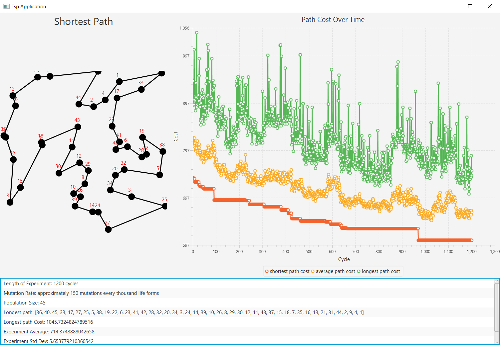

# TSP Genetic Algorithm Application
This is an application for solving the Traveling Salesman Problem using a genetic algorithm.

  

**What is the Traveling Salesman Problem?**
You are a salesman with a list of cities where you must go and sell your product. You want to go and sell to every one of these cities and then return to the city where you started. To find the most efficient way to do this, you must calculate the path around these cities which has the shortest length. The challenge to this problem is finding a solution which does not grow in time polynomially with respect to the amount of cities in your list. 

**What is a genetic algorithm?**
An algorithm which mimics the process of natural selection in which all lifeforms breed, mutate, and die.
A genetic algorithm goes through these same cycles and as it does, it improves itself.

**What does the TSP Genetic Algorithm Application do?**
This application aims to find near-optimal results for the TSP in non-polynomial time using a genetic algorithm.
To do this, a population of solutions is put through the three basic events which shape a living thing's genetics: breeding, mutation, and death.
This population is run through these three basic events a specified number of times in what are called cycles.
This population improves itself each cycle until eventually a ceiling is reached where the algorithm is no longer making significant improvments.
At this ceiling, the genetic algorithm has reached its best population.
Contained within this best population is the best solution which the application could find.
This application oftenly finds the best possible solution but has no way of confirming it has without doing an exhaustive check of every possible path.

**How can I test out the application**
To test out this application, first use git clone or the project's download link to save the project to your device.
Next, use Eclipse or an equivalent Java IDE to set up the project's directory as a new project.
Lastly, run GeneticAlgorithmSolverApp.Java and the application will run.

**How can i customize the application's parameters?**
Under GeneticAlgorithmSolverApp.Java you can make changes to the following variables found at the top of the file:
- Integer **NUMBER_OF_CITIES** // Determines the number of cities applied to the TSP
- Integer **MAX_POPULATION_SIZE** // Limits the maximum size of our genetic population
- Integer **EXPERIMENT_LENGTH** // Determines how many cycles the genetic algorithm will go through
- Integer **MUTATIONS_OF_1000** // Determines how many lifeforms of 1000 will go through mutations each cycle

